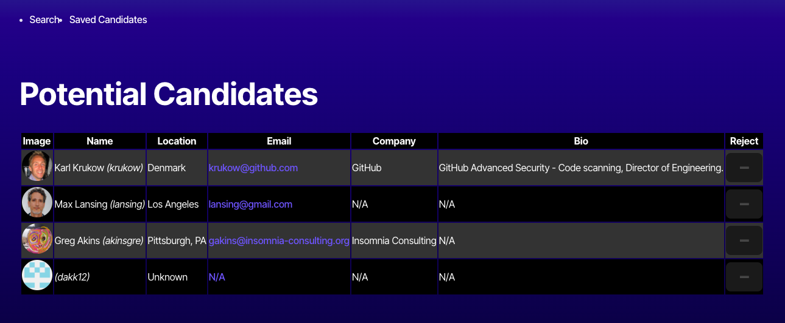

# Candidate Search

## Description

Candidate Search is a React + TypeScript application that helps employers search for potential job candidates by pulling public GitHub user data. The app displays candidate information and allows users to accept or reject them. Accepted candidates are stored locally and viewable on a separate page. This project demonstrates API interaction, conditional rendering, state management, routing, and persistent local storage in a front-end web application.

---

## Table of Contents

- [Installation](#installation)
- [Usage](#usage)
- [Features](#features)
- [Screenshots](#screenshots)
- [Credits](#credits)
- [License](#license)
- [Deployed Application](#deployed-application)

---

## Installation

1. Clone the repository:
   ```bash
   git clone https://github.com/eholt19/Candidate-Search.git
   cd Candidate-Search
   ```

2. Install dependencies:
   ```bash
   npm install
   ```

3. Create a GitHub personal access token and add it to a `.env` file in the root of the project:
   ```
   VITE_GITHUB_TOKEN=your_personal_access_token_here
   ```

4. Start the development server:
   ```bash
   npm run dev
   ```

---

## Usage

- When the app loads, a GitHub user is displayed with their profile information.
- Click the ➕ button to save the candidate to your potential list.
- Click the ➖ button to skip the candidate.
- Navigate to the **Saved Candidates** page to view previously accepted profiles.
- Saved candidates persist using localStorage, even after refresh.

---

## Features

- GitHub API integration with authentication token
- React Router with multi-page navigation
- Functional components and hooks (`useState`, `useEffect`)
- Persistent local storage for saved candidates
- Responsive card-based UI
- Error handling for empty results or connection issues

---

## Screenshots




---

## Credits

- [GitHub REST API Documentation](https://docs.github.com/en/rest)
- [Render Static Site Deployment Guide](https://coding-boot-camp.github.io/full-stack/render/render-deployment-guide)
- Bootcamp Starter Code & Assignment Instructions

---

## License

This project is licensed under the MIT License.

---

## Deployed Application

- [GitHub Repository](https://github.com/eholt19/Candidate-Search)
- [Live Site on Render](https://candidate-search-1-6aeo.onrender.com)

---

### ⚠️ Deployment Note

> If the deployed site shows a `404: Page Not Found`, please refresh or navigate using the homepage links. This project uses React Router and Render static hosting, which requires a `_redirects` file for routing. All functionality works correctly once the app loads.
